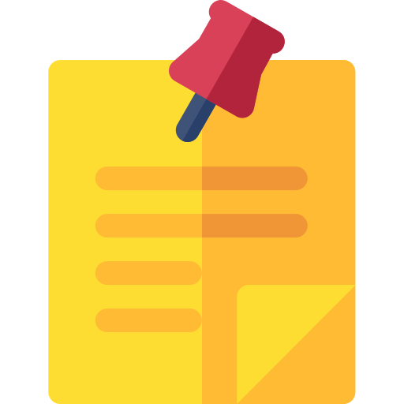

 </img>
 
# `Speak Notes`

 
Speak Notes is a note-taking mobile application for the visually impaired. Its features include:

- Read signs and documents
- Realtime OCR and reading
- Take notes by speech
- Save & Read notes

-----------------------------------------------

### Scan a document

 

 </img>
 

### Take Notes
 

 </img>
 

### View Notes
 

 </img>
 

### Realtime OCR

 </img>
 

-----------------------------------------------

## Getting Started

### API Integrations

* [Google Vision API](https://cloud.google.com/vision)
* [Google STT](https://cloud.google.com/speech-to-text/?utm_source=google&utm_medium=cpc&utm_campaign=japac-IN-all-en-dr-bkws-all-super-trial-e-dr-1008074&utm_content=text-ad-none-none-DEV_c-CRE_256563243540-ADGP_Hybrid+%7C+AW+SEM+%7C+BKWS+~+T1+%7C+EXA+%7C+ML+%7C+1:1+%7C+IN+%7C+en+%7C+Speech+%7C+google+speech+to+text-KWID_43700030970546716-kwd-21425535976&userloc_9062223&utm_term=KW_google%20speech%20to%20text&ds_rl=1264446&gclid=EAIaIQobChMI45K3uL756AIVBHZgCh0IAAmOEAAYASAAEgILovD_BwE)
* [Google TTS](https://cloud.google.com/text-to-speech/?utm_source=google&utm_medium=cpc&utm_campaign=japac-IN-all-en-dr-bkws-all-all-trial-b-dr-1008074&utm_content=text-ad-none-none-DEV_c-CRE_286167449401-ADGP_Hybrid+%7C+AW+SEM+%7C+BKWS+~+T1+%7C+BMM+%7C+ML+%7C+M:1+%7C+IN+%7C+en+%7C+Speech+%7C+Text+to+Speech-KWID_43700035532797889-kwd-309378385650&userloc_9062223&utm_term=KW_%2Bgoogle%20%2Btext%20%2Bto%20%2Bspeech&ds_rl=1264446&gclid=EAIaIQobChMI15Kk07756AIVxhSPCh0C9g61EAAYASAAEgIEn_D_BwE)

### How to use

Turn the Accessibility feature ON and set to talk-back. Press and hold the button on screen to speak commands.
* Tap once to read element
* Tap twice to select element
* Scroll with two-finger scroll

-----------------------------------------------
## Future Enhancements

- [ ] Full Voice Control
- [ ] Gesture Control

 ----------------------------------------------- 

## Contributors
* [Amisha Waghela](https://github.com/amisha-w)
* [Vikram Bhavsar](https://github.com/vikramBhavsar)

-----------------------------------------------

